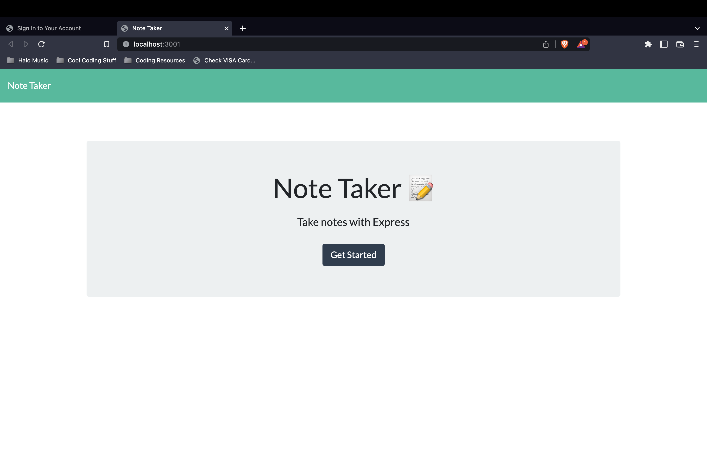
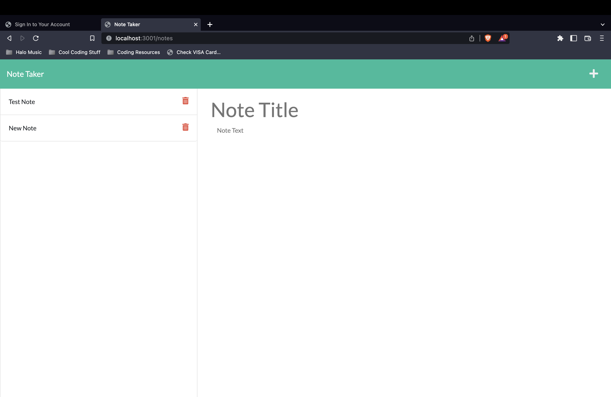
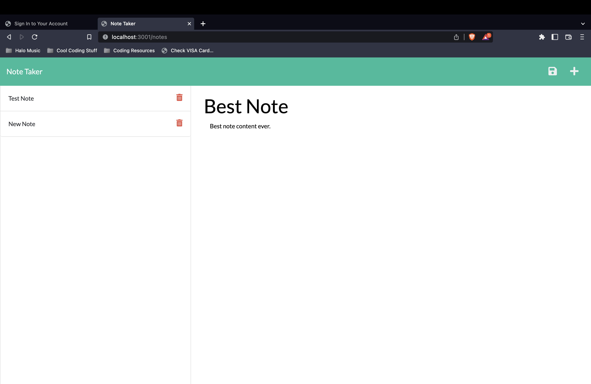
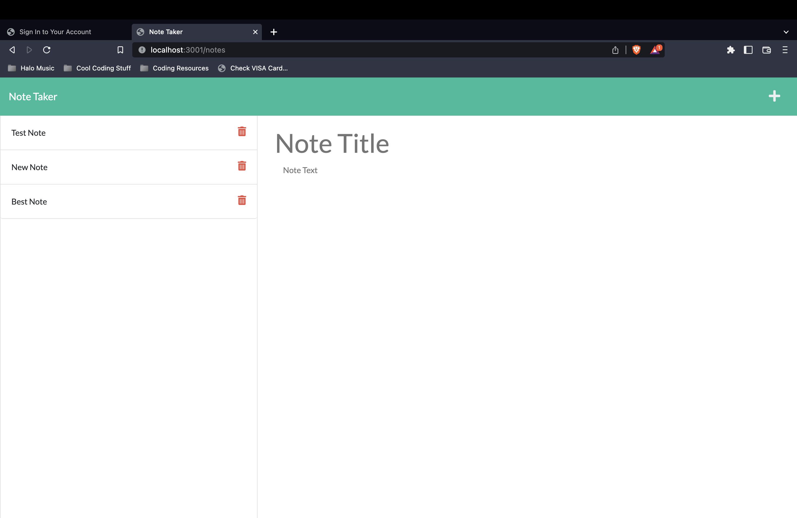
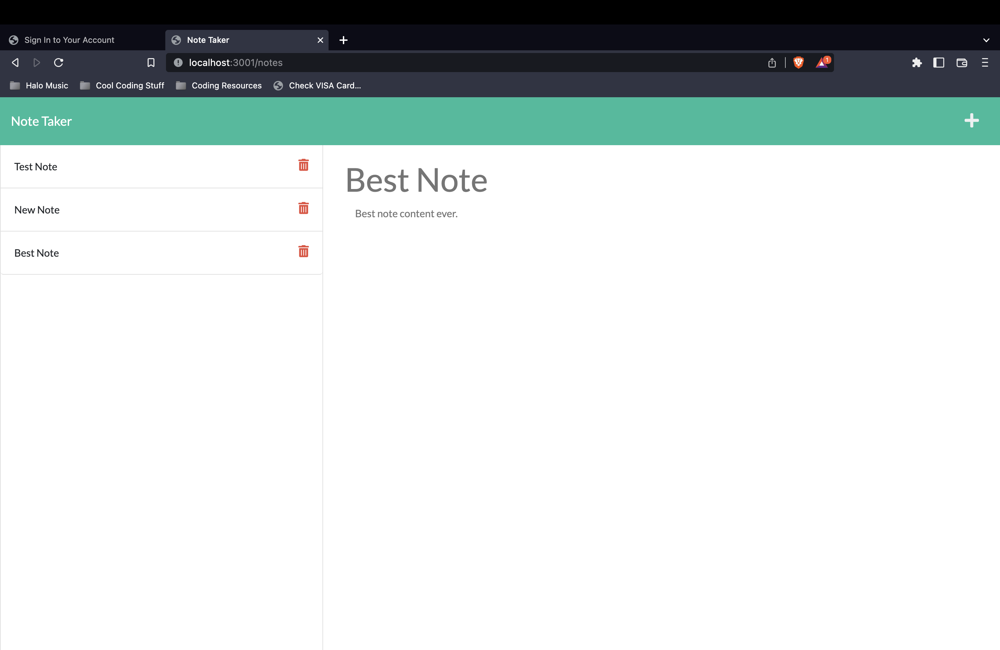

# 

# NoteBuddy

## Description
This is a web app that will fill all of your note taking needs! It creates a database holding all of your notes and the app can dynamically add and delete your notes in the database.

## Table of Contents
1. [Installation](#installation)
#
2. [Usage](#usage)
#
3. [License](#license)
#
4. [Contribute](#contributing)
#
5. [Tests](#tests)
#
6. [Screenshots](#screenshots)
#
7. [Questions](#questions)

(<a href="#mit-license">back to top</a>)

## Installation
Open the project folder in the terminal and type in the command 'npm i'. Once that is done, type 'node index.js' or 'npm start' (it can also be started using nodemon using the command 'nodemon'). You should then be able to command click the link in the terminal or just type 'localhost:3001/' into your web browser and hit enter.

(<a href="#mit-license">back to top</a>)

## Usage
Using this project is super easy, once you are the website, press the get started button, from here you can type in the note area (once both fields have text, the save button will appear in the top right) or view your old notes by clicking on them on the left-hand side. These old notes can also be deleted using the red trash can icon.

(<a href="#mit-license">back to top</a>)

## License
[MIT License](https://opensource.org/licenses/MIT)

(<a href="#mit-license">back to top</a>)

## Contributing
Bfunk54/NoteBuddy

(<a href="#mit-license">back to top</a>)

## Tests
To test, use a program such as DBeaver to see the database and see how all notes save and delete from the database. You can also test by using the website and seeing if all functions are working correctly.

(<a href="#mit-license">back to top</a>)

## Screenshots

(<a href="mit-license">back to top</a>)

## Questions
Github: https://github.com/Bfunk54

Email me with any questions: ben_fein@icloud.com

(<a href="#mit-license">back to top</a>)

## Link to the site:
[NoteBuddy](https://the-note-buddy.herokuapp.com/)
[Github Repo](https://github.com/Bfunk54/NoteBuddy)

(<a href="#mit-license">back to top</a>)

